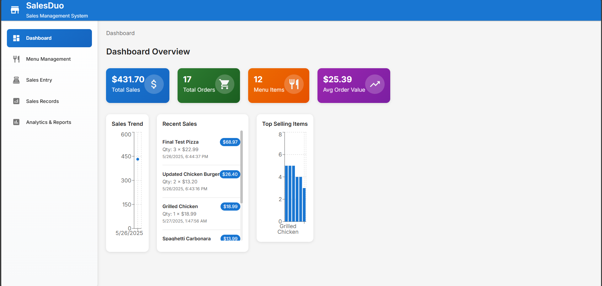
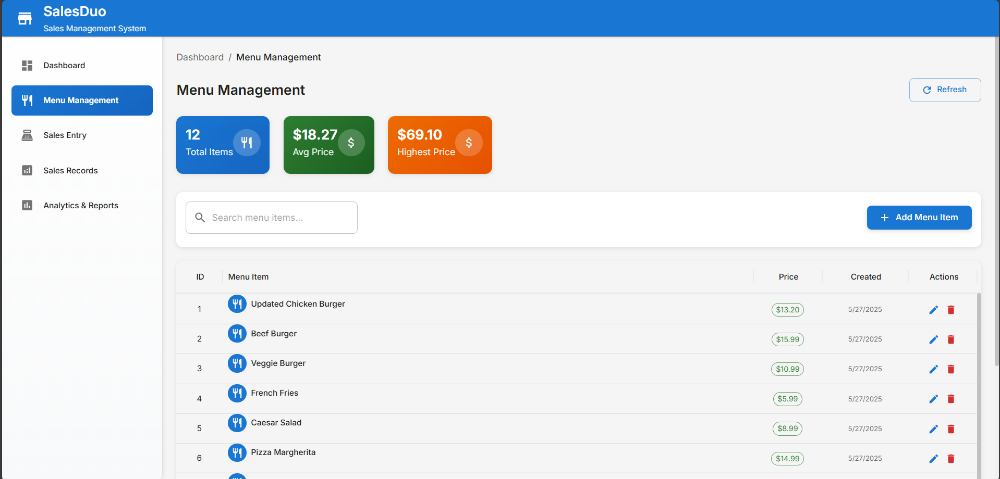
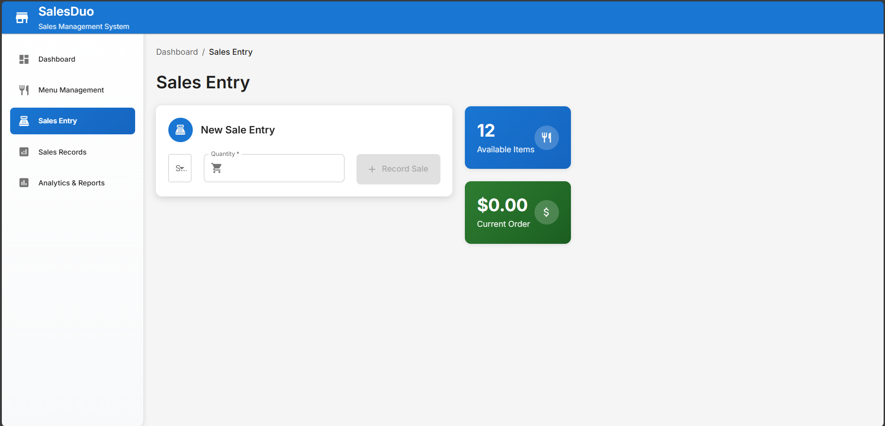
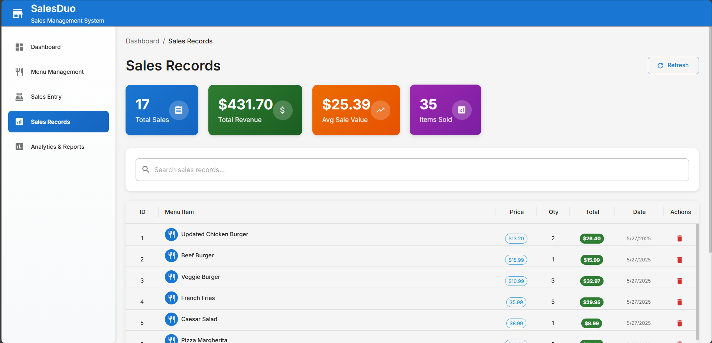
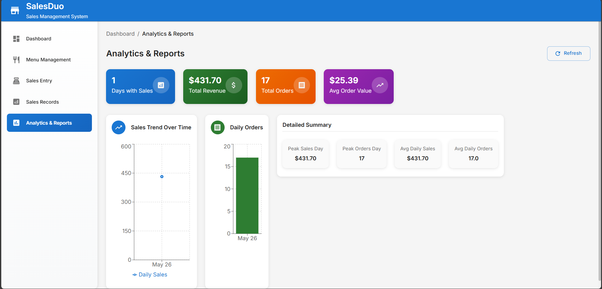

# SalesDuo - Professional Sales Management System

## 🎉 Complete UI Redesign

The SalesDuo application has been completely transformed from a basic calculator-like interface to a professional, modern Sales Management System using Material-UI and React best practices.

## ✨ Key Features Implemented

### 🏗️ Modern Architecture

- **Material-UI (MUI)** - Professional component library with consistent design system
- **Custom Theme** - Comprehensive theme configuration with brand colors and typography
- **Responsive Design** - Fully responsive layout that works on all device sizes
- **Professional Navigation** - Sidebar navigation with icons and active states

### 📊 Dashboard

- **Real-time Metrics** - Live statistics cards showing key business metrics
- **Interactive Charts** - Data visualization using Recharts library
- **Quick Actions** - Easy access to common operations
- **Recent Activity** - Overview of recent sales and menu items

### 🍽️ Menu Management

- **DataGrid Integration** - Professional data table with sorting, filtering, and pagination
- **CRUD Operations** - Complete Create, Read, Update, Delete functionality
- **Form Validation** - Robust client-side validation with user feedback
- **Search & Filter** - Real-time search capabilities
- **Statistics Cards** - Visual metrics for menu items

### 💰 Sales Management

- **Modern Forms** - Clean, intuitive forms with Material-UI components
- **Order Preview** - Real-time calculation and preview of orders
- **Visual Feedback** - Progress indicators and success/error notifications
- **Menu Integration** - Seamless integration with menu data

### 📈 Sales Records

- **Advanced Data Grid** - Feature-rich table with sorting and filtering
- **Statistics Dashboard** - Comprehensive metrics and KPIs
- **Export Capabilities** - Ready for future export functionality
- **Delete Confirmation** - Safe deletion with confirmation dialogs

### 📊 Analytics & Reports

- **Interactive Charts** - Line charts and bar charts using Recharts
- **Trend Analysis** - Visual representation of sales trends over time
- **Key Metrics** - Summary statistics and performance indicators
- **Responsive Charts** - Charts that adapt to different screen sizes

## 🛠️ Technical Improvements

### Components Redesigned

1. **App.jsx** - Complete layout transformation with MUI AppBar and Drawer
2. **MenuManager.jsx** - Professional data management with MUI DataGrid
3. **SalesManager.jsx** - Modern form design with real-time previews
4. **SalesDisplay.jsx** - Advanced data table with search and filtering
5. **SalesChart.jsx** - Interactive charts with Recharts integration
6. **Dashboard.jsx** - Comprehensive metrics dashboard (NEW)

### Design System

- **Theme Configuration** - Centralized theme with consistent colors and typography
- **Component Styling** - Professional styling with gradients and shadows
- **Icons Integration** - Material Design icons throughout the application
- **Toast Notifications** - User-friendly feedback system

### Data Handling

- **API Integration** - Seamless integration with Laravel backend
- **Error Handling** - Robust error handling with user-friendly messages
- **Loading States** - Professional loading indicators
- **Real-time Updates** - Automatic data refresh capabilities

## 🎨 Visual Enhancements

### Color Scheme

- **Primary Blue** - Professional blue tones for primary actions
- **Success Green** - Green accents for positive actions and metrics
- **Warning Orange** - Orange for attention-grabbing elements
- **Error Red** - Red for warnings and deletion actions

### Typography

- **Roboto Font** - Clean, professional typography
- **Hierarchical Text** - Clear text hierarchy with appropriate sizing
- **Color Coding** - Strategic use of color for information hierarchy

### Layout

- **Card-based Design** - Clean card layouts for content organization
- **Grid System** - Responsive grid system for flexible layouts
- **Spacing** - Consistent spacing throughout the application
- **Shadows & Elevation** - Subtle shadows for visual depth

## 🚀 Performance Optimizations

- **Component Optimization** - Efficient React component structure
- **Lazy Loading** - Optimized loading patterns
- **State Management** - Clean state management with React hooks
- **API Efficiency** - Optimized API calls and data handling

## 📱 Responsive Design

The application now works seamlessly across:

- **Desktop** - Full-featured desktop experience
- **Tablet** - Optimized tablet layout with collapsible sidebar
- **Mobile** - Mobile-first responsive design

## 🔧 Installation & Setup

### Frontend (React + Vite)

```bash
cd sales_front
npm install
npm run dev
```

### Backend (Laravel)

```bash
cd sales_back
php artisan serve
```

## 🌐 Access URLs

- **Frontend**: http://localhost:5173
- **Backend API**: http://127.0.0.1:8000/api

## 📝 Notes

- All original functionality has been preserved
- Backend API remains unchanged and fully functional
- Modern UI/UX patterns implemented throughout
- Professional branding and visual identity established
- Ready for production deployment

The application now presents a professional appearance suitable for business use, with modern design patterns, responsive layouts, and an intuitive user experience.










