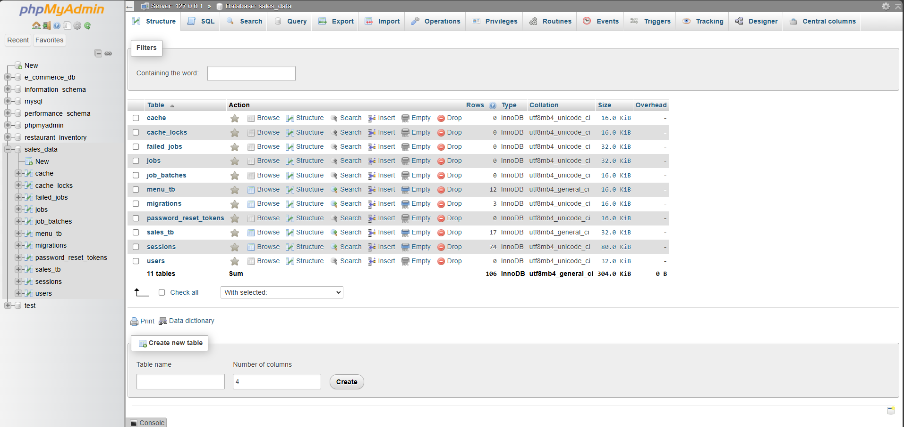
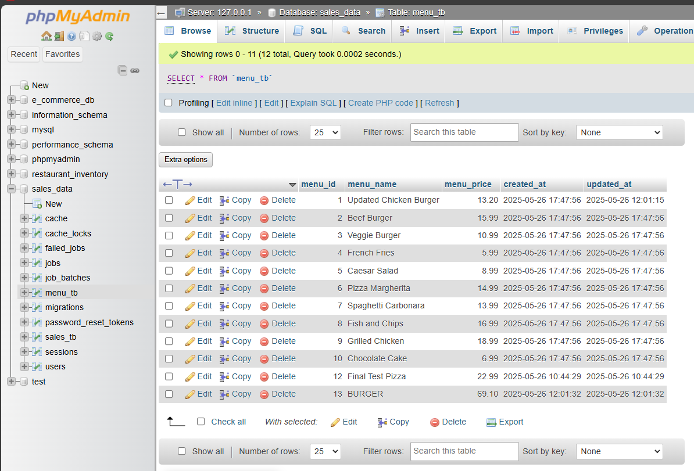
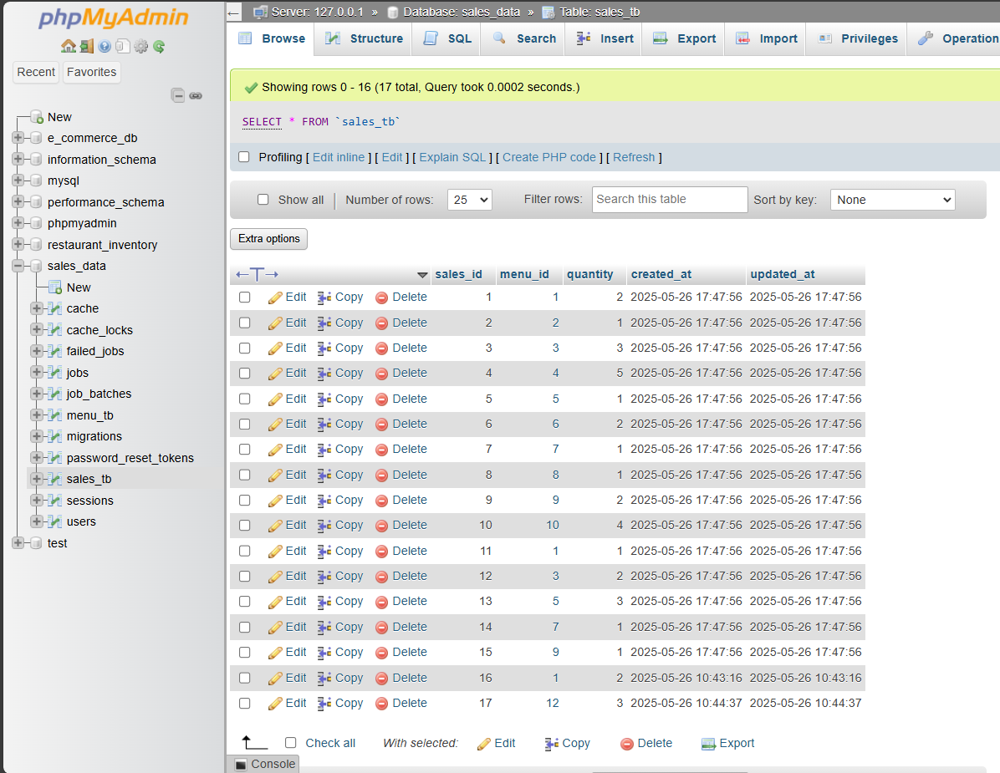

# SalesDuo - Pasion

### Frontend (React + Vite)

```bash
cd sales_front
npm install
npm run dev
```

### Backend (Laravel)

```bash
cd sales_back
php artisan serve
```

## 🌐 Access URLs

- **Frontend**: http://localhost:5173
- **Backend API**: http://127.0.0.1:8000/api

## 📝 Notes

- All original functionality has been preserved
- Backend API remains unchanged and fully functional
- Modern UI/UX patterns implemented throughout
- Professional branding and visual identity established
- Ready for production deployment

The application now presents a professional appearance suitable for business use, with modern design patterns, responsive layouts, and an intuitive user experience.




menu_tb:


sales_tb:

